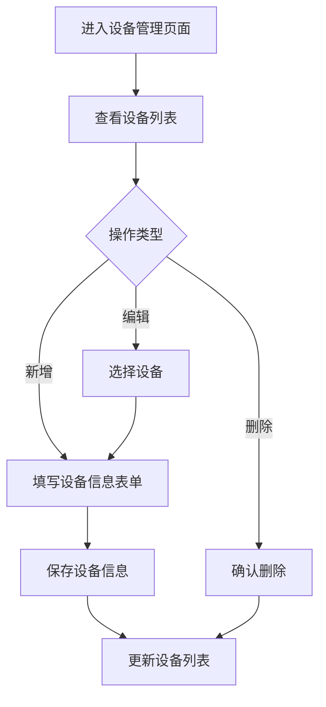
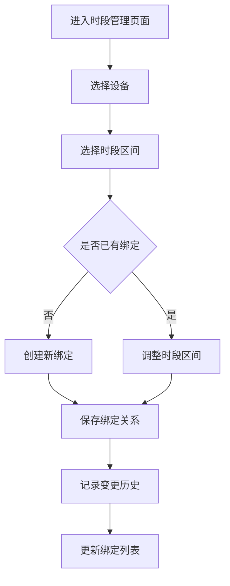
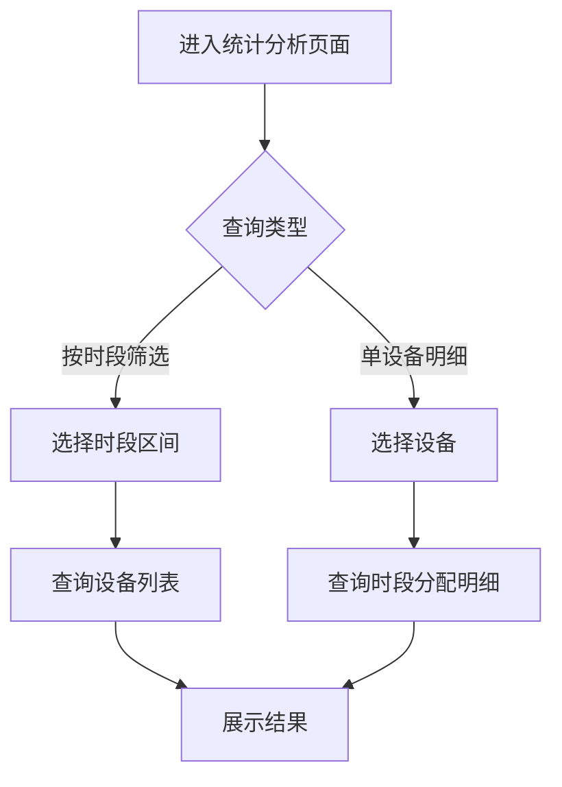

## 1. Product Overview
机场航站楼母婴室配套设备使用时段关联登记系统，用于管理母婴室配套设备的使用时段分配与变更记录。核心特色是设备绑定固定使用时段区间，支持运营排班调整时的时段管理。

- **目标用户**: 机场后勤管理人员
- **核心价值**: 实现设备时段分配的规范化管理，提高运营效率，留存变更记录便于追溯

## 2. Core Features

### 2.1 User Roles
| Role | Registration Method | Core Permissions |
|------|---------------------|------------------|
| 管理员 | 系统配置 | 设备档案管理、时段绑定、变更记录查看、统计分析 |

### 2.2 Feature Module
1. **设备管理**: 设备档案录入、编辑、删除、列表展示
2. **时段绑定**: 设备运营时段区间初始分配与调整
3. **变更记录**: 时段调整历史记录查询
4. **统计分析**: 按时段筛选设备、单设备全时段分配明细

### 2.3 Page Details
| Page Name | Module Name | Feature description |
|-----------|-------------|---------------------|
| 设备管理 | 设备列表 | 展示所有设备档案，支持按航站楼分区筛选 |
| 设备管理 | 设备表单 | 新增/编辑设备：设备编号、功能类型、航站楼分区 |
| 时段管理 | 时段绑定列表 | 展示设备与时段的绑定关系 |
| 时段管理 | 时段分配 | 为设备分配/调整运营时段区间 |
| 变更记录 | 记录查询 | 查询设备时段变更历史 |
| 统计分析 | 时段筛选 | 按时段区间筛选对应全部设备 |
| 统计分析 | 明细查看 | 查看单台设备绑定的全部时段区间 |

## 3. Core Process

### 设备档案管理流程

### 时段绑定流程

### 统计查询流程

## 4. User Interface Design

### 4.1 Design Style
- **主色调**: 蓝色系 (#1E88E5)，体现专业、可信赖的管理系统气质
- **辅助色**: 绿色 (#43A047) 用于成功状态，橙色 (#FB8C00) 用于警告状态，红色 (#E53935) 用于错误状态
- **按钮风格**: 圆角矩形，主按钮使用渐变色，悬停有阴影效果
- **字体**: 使用无衬线字体，标题加粗，正文清晰易读
- **布局风格**: 卡片式布局，左侧导航栏，右侧内容区
- **图标风格**: 简洁现代的线性图标

### 4.2 Page Design Overview
| Page Name | Module Name | UI Elements |
|-----------|-------------|-------------|
| 设备管理 | 设备列表 | 卡片列表、筛选栏、分页、操作按钮 |
| 设备管理 | 设备表单 | 表单输入框、下拉选择、日期选择器 |
| 时段管理 | 时段绑定列表 | 表格展示、操作列 |
| 时段管理 | 时段分配 | 设备选择器、时段区间选择控件 |
| 变更记录 | 记录查询 | 时间筛选、列表展示 |
| 统计分析 | 时段筛选 | 时段区间选择器、设备列表 |
| 统计分析 | 明细查看 | 详情卡片、时段时间轴 |

### 4.3 Responsiveness
- **桌面优先**: 1200px+ 宽度，左侧固定导航，右侧响应式内容
- **平板适配**: 768px-1199px，导航折叠为图标模式
- **移动端**: <768px，导航转为底部或侧边抽屉

### 4.4 3D Scene Guidance
不适用，本项目为管理系统，无3D场景需求。