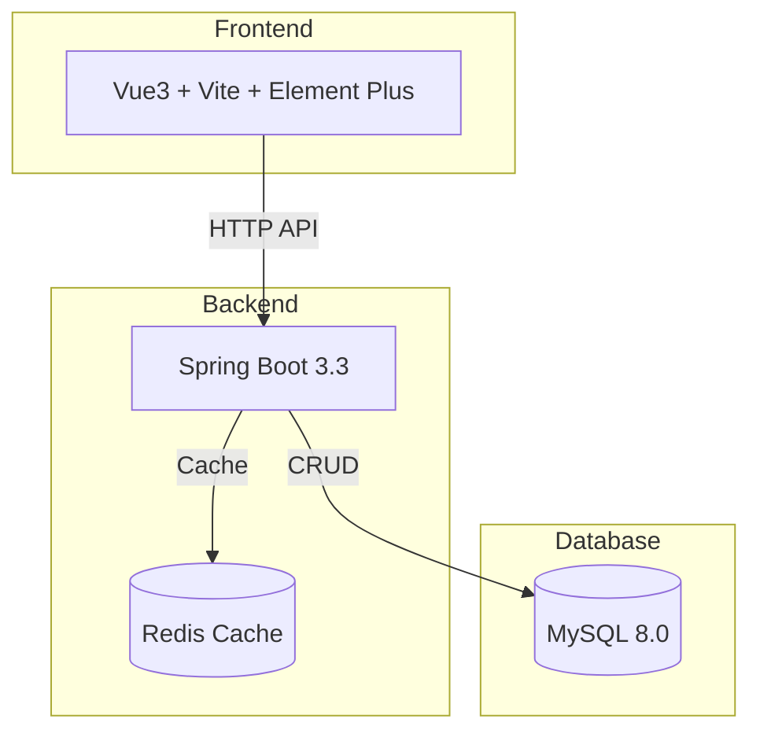
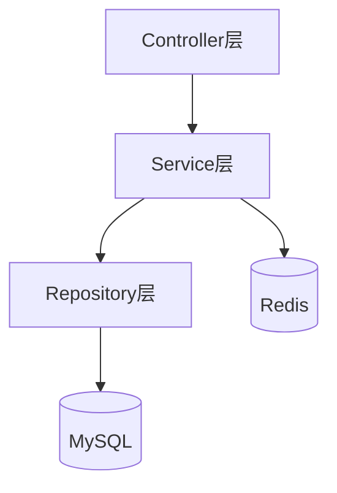
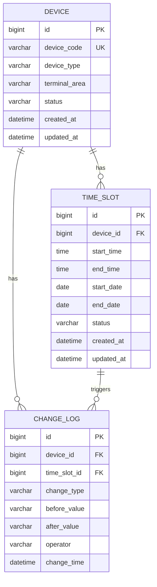

## 1. Architecture Design



## 2. Technology Description

- **Frontend**: Vue3 + Vite + Element Plus + TypeScript
- **Backend**: Spring Boot 3.3 + JDK 17 + Maven
- **Database**: MySQL 8.0
- **Cache**: Redis 7.0+
- **Containerization**: Docker + Docker Compose

## 3. Route Definitions

| Route | Purpose |
|-------|---------|
| / | 首页/仪表盘 |
| /devices | 设备管理列表 |
| /devices/add | 新增设备 |
| /devices/edit/:id | 编辑设备 |
| /time-slots | 时段绑定管理 |
| /time-slots/allocate | 时段分配 |
| /change-logs | 变更记录 |
| /statistics | 统计分析 |

## 4. API Definitions

### 4.1 Device API

#### GET /api/devices
查询设备列表
- **Request**: 
  - `page`: number, 页码
  - `size`: number, 每页数量
  - `terminalArea`: string, 航站楼分区（可选）
  - `deviceType`: string, 设备类型（可选）
- **Response**: 
  ```json
  {
    "code": 200,
    "data": {
      "content": [...],
      "totalElements": 100,
      "totalPages": 10
    }
  }
  ```

#### GET /api/devices/{id}
查询设备详情
- **Response**: 
  ```json
  {
    "code": 200,
    "data": {
      "id": 1,
      "deviceCode": "DEV001",
      "deviceType": "母婴室",
      "terminalArea": "T1航站楼",
      "status": "正常",
      "createdAt": "2024-01-01 10:00:00"
    }
  }
  ```

#### POST /api/devices
新增设备
- **Request**: 
  ```json
  {
    "deviceCode": "DEV001",
    "deviceType": "母婴室",
    "terminalArea": "T1航站楼",
    "status": "正常"
  }
  ```

#### PUT /api/devices/{id}
更新设备
- **Request**: 同新增

#### DELETE /api/devices/{id}?force=false
删除设备
- 设备有进行中（startDate <= 今天 <= endDate）的「生效中」占用时：
  - `force=false`（默认）：返回 409 业务错误并点名具体时段，设备与时段均不删除
  - `force=true`：先把全部未结束占用置为「已失效」并逐段写变更记录（含一条「设备删除」汇总记录），再在同一事务内删除设备与其名下全部时段，不留孤儿时段
- 没有进行中占用时，`force=false` 也会直接删除（未开始占用同样先失效留痕）

#### PUT /api/devices/{id}（停用联动）
设备状态改为「停用」时，同一事务内把名下尚未结束（endDate >= 今天）的「生效中」占用全部置为「已失效」并逐段写「时段失效」变更，已结束的历史时段不动；停用设备不能再保存「生效中」时段，统计「按时段筛选」与高峰在用数均不再计入。

### 4.2 TimeSlot API

#### GET /api/time-slots
查询时段绑定列表
- **Request**: 
  - `page`: number
  - `size`: number
  - `deviceId`: number（可选）
- **Response**: 
  ```json
  {
    "code": 200,
    "data": {
      "content": [
        {
          "id": 1,
          "deviceId": 1,
          "deviceCode": "DEV001",
          "startTime": "08:00",
          "endTime": "20:00",
          "dateRange": "2024-01-01 ~ 2024-12-31",
          "status": "生效中"
        }
      ]
    }
  }
  ```

#### POST /api/time-slots
创建时段绑定
- **Request**: 
  ```json
  {
    "deviceId": 1,
    "startTime": "08:00",
    "endTime": "20:00",
    "startDate": "2024-01-01",
    "endDate": "2024-12-31"
  }
  ```

#### PUT /api/time-slots/{id}
调整时段绑定
- **Request**: 同创建

#### DELETE /api/time-slots/{id}
删除时段绑定

### 4.3 ChangeLog API

#### GET /api/change-logs
查询变更记录
- **Request**: 
  - `page`: number
  - `size`: number
  - `deviceId`: number（可选）
  - `startDate`: string（可选）
  - `endDate`: string（可选）
- **Response**: 
  ```json
  {
    "code": 200,
    "data": {
      "content": [
        {
          "id": 1,
          "deviceId": 1,
          "deviceCode": "DEV001",
          "changeType": "时段调整",
          "beforeValue": "08:00-20:00",
          "afterValue": "07:00-22:00",
          "changeTime": "2024-01-15 14:30:00",
          "operator": "admin"
        }
      ]
    }
  }
  ```

### 4.4 Statistics API

#### GET /api/statistics/by-time
按时段筛选设备
- **Request**: 
  - `startTime`: string, e.g., "08:00"
  - `endTime`: string, e.g., "20:00"
- **Response**: 
  ```json
  {
    "code": 200,
    "data": [
      {
        "id": 1,
        "deviceCode": "DEV001",
        "deviceType": "母婴室",
        "terminalArea": "T1航站楼"
      }
    ]
  }
  ```

#### GET /api/statistics/device-detail/{deviceId}
单设备全时段分配明细
- **Response**: 
  ```json
  {
    "code": 200,
    "data": {
      "device": {...},
      "timeSlots": [...]
    }
  }
  ```

## 5. Server Architecture Diagram



## 6. Data Model

### 6.1 Data Model Definition



### 6.2 Data Definition Language

#### DEVICE 表
```sql
CREATE TABLE device (
    id BIGINT PRIMARY KEY AUTO_INCREMENT,
    device_code VARCHAR(50) NOT NULL UNIQUE,
    device_type VARCHAR(50) NOT NULL,
    terminal_area VARCHAR(100) NOT NULL,
    status VARCHAR(20) DEFAULT '正常',
    created_at DATETIME DEFAULT CURRENT_TIMESTAMP,
    updated_at DATETIME DEFAULT CURRENT_TIMESTAMP ON UPDATE CURRENT_TIMESTAMP,
    INDEX idx_device_type (device_type),
    INDEX idx_terminal_area (terminal_area)
);
```

#### TIME_SLOT 表
```sql
CREATE TABLE time_slot (
    id BIGINT PRIMARY KEY AUTO_INCREMENT,
    device_id BIGINT NOT NULL,
    start_time TIME NOT NULL,
    end_time TIME NOT NULL,
    start_date DATE NOT NULL,
    end_date DATE NOT NULL,
    status VARCHAR(20) DEFAULT '生效中',
    created_at DATETIME DEFAULT CURRENT_TIMESTAMP,
    updated_at DATETIME DEFAULT CURRENT_TIMESTAMP ON UPDATE CURRENT_TIMESTAMP,
    FOREIGN KEY (device_id) REFERENCES device(id) ON DELETE CASCADE,
    INDEX idx_device_id (device_id),
    INDEX idx_time_range (start_time, end_time)
);
```

#### CHANGE_LOG 表
```sql
CREATE TABLE change_log (
    id BIGINT PRIMARY KEY AUTO_INCREMENT,
    device_id BIGINT NOT NULL,
    time_slot_id BIGINT,
    change_type VARCHAR(50) NOT NULL,
    before_value TEXT,
    after_value TEXT,
    operator VARCHAR(50) DEFAULT 'admin',
    change_time DATETIME DEFAULT CURRENT_TIMESTAMP,
    FOREIGN KEY (device_id) REFERENCES device(id) ON DELETE CASCADE,
    FOREIGN KEY (time_slot_id) REFERENCES time_slot(id) ON DELETE SET NULL,
    INDEX idx_device_id (device_id),
    INDEX idx_change_time (change_time)
);
```

### 6.3 Redis Cache Structure

- **Key**: `device_category_template`
- **Value**: JSON字符串，存储设备分类模板
- **Expiration**: 30分钟

```json
{
    "deviceTypes": ["母婴室", "哺乳室", "婴儿护理台", "育婴室"],
    "terminalAreas": ["T1航站楼", "T2航站楼", "T3航站楼", "国际出发区", "国内到达区"]
}
```